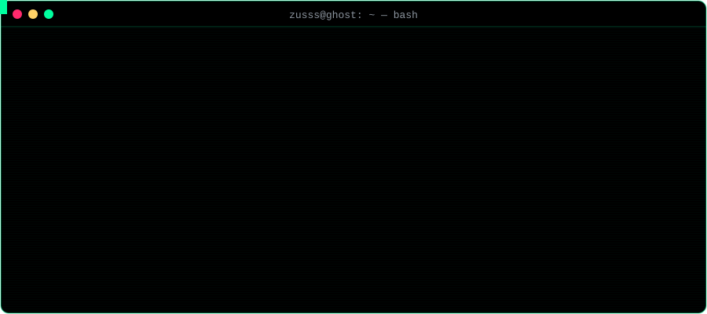

<!-- 🚩 flag 2/2 — you read the source. respect. decode me (hex): 5a555353537b346c773479735f723334645f7468335f7330757263337d -->

<p align="center">
  
</p>

<p align="center">
  
</p>

<p align="center">
  
  <a href="https://medium.com/@secret_zuss"></a>
  <a href="https://www.linkedin.com/in/abdullah-ammar-ali-068023279"></a>
</p>

<p align="center">
  
</p>

---

### `zusss@ghost:~$ ls -la ./projects`

| | Project | What it does | Stack |
|---|---|---|---|
| 🛰️ | [**alphaMountain-MCP**](https://github.com/ZuuuSSzz/alphaMountain-MCP) | MCP server that gives LLM agents threat intel, URL categorization and domain intelligence | `Python` `MCP` |
| 📷 | [**Quishing-using-deep-learning**](https://github.com/ZuuuSSzz/Quishing-using-deep-learning) | Detects QR-code phishing with deep learning | `Python` `DL` |
| 📄 | [**docling-RAG**](https://github.com/ZuuuSSzz/docling-RAG) | RAG pipeline built on Docling document parsing | `Python` `RAG` |
| 📊 | [**rag-eval-kit**](https://github.com/ZuuuSSzz/rag-eval-kit) | Measures RAG retrieval and answer quality | `Python` `Eval` |
| ⚡ | [**vLLM-evaluation**](https://github.com/ZuuuSSzz/vLLM-evaluation) | Benchmarks LLM serving with vLLM | `Python` `vLLM` |
| 🎣 | [**AnalyticsZphisher**](https://github.com/ZuuuSSzz/AnalyticsZphisher) | Analytics for phishing simulations (authorized awareness testing) | `Shell` |

---

### `zusss@ghost:~$ cat ./.arsenal`

<details open>
<summary><b>🧠 AI / ML</b></summary>
<br/>
<p>
  
  <br/><br/>
  
  
  
  
  
  
</p>
</details>

<details open>
<summary><b>🛡️ Security</b></summary>
<br/>
<p>
  
  
  
  
  
  
</p>
</details>

<details open>
<summary><b>⚙️ Infra / Tooling</b></summary>
<br/>
<p>
  
</p>
</details>

---

### `zusss@ghost:~$ ./telemetry --live`

<p align="center">
  
</p>

<p align="center">
  
  
</p>

<p align="center">
  
</p>

---

### `zusss@ghost:~$ tail -f ./medium/latest.log`

<!-- BLOG-POST-LIST:START -->
<!-- Auto-filled by GitHub Actions. Don't edit between these markers. -->
<!-- BLOG-POST-LIST:END -->

➡️ [All posts on Medium](https://medium.com/@secret_zuss)

---

### `zusss@ghost:~$ ./ctf --start`

<details>
<summary>🚩 <b>Mini CTF: there are 2 flags hidden on this page. Click to begin.</b></summary>
<br/>

**Flag 1/2**: the intercepted transmission below went through two layers. One of them rotates, the other is the classic 64.

```
JyIGH1A7L3IlnGOmZKE5KmSmK215K2L0qwOlZKDmK3M1oT59
```

**Flag 2/2**: not everything on this page is rendered. Look closer.

Flag format: `ZUSSS{...}`. Got both? Send them to me on LinkedIn and say hi. 👾

<details>
<summary>💡 Stuck? Hint</summary>
<br/>

Flag 1: ROT13 first, then Base64-decode. Flag 2: view this README's raw source.

</details>
</details>

---

<p align="center">
  
  <br/>
  <code>connection closed by remote host. stay curious.</code>
</p>
